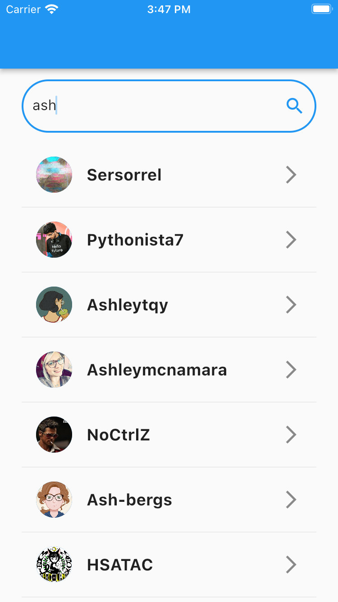
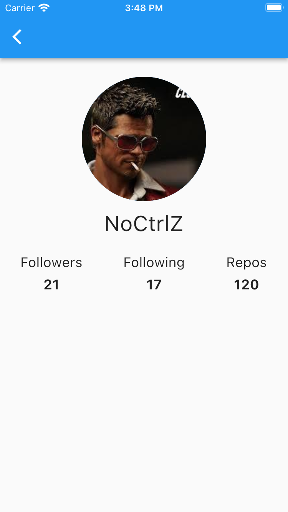

# Github demo

__Atividade:__ Criar um app que faça consultas à API do Github. ele teve ser feito seguindo o padrão MVC. Usar o _dio_ para realizar as consultas e o _get_it_ para fazer a injeção das dependencias (repositories e controllers).

## Funcionalidades
- Pesquisar usuários pelo nome
- Ver detalhes de um usuário

## Screen shots

